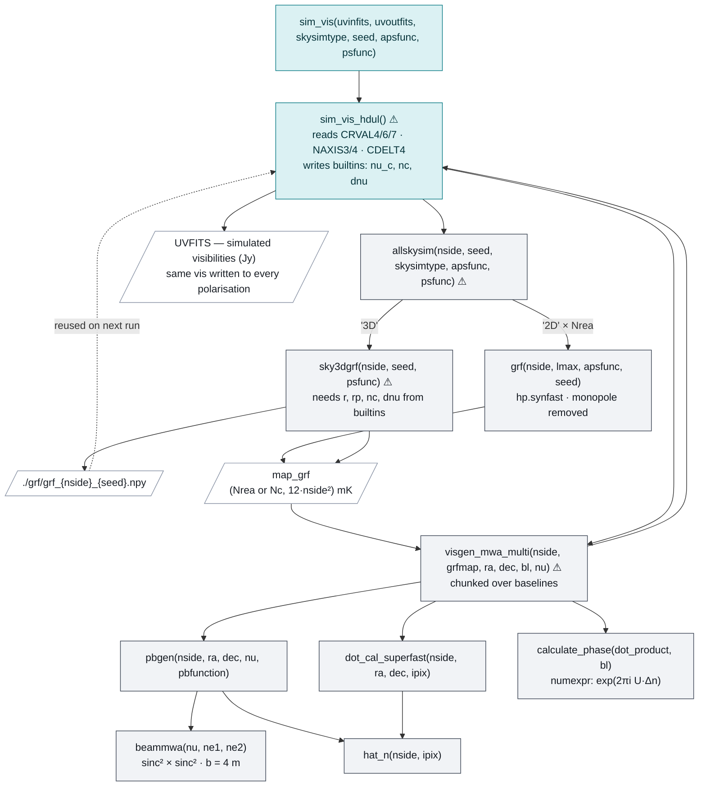

# `myutils` — code flowcharts

Companion to [`PIPELINE.md`](PIPELINE.md). Three views of the same code: the end-to-end
pass structure, the `simvis` call graph, and the `psfuncs` estimation chain.

Colour coding throughout: **amber = data pass**, **teal = UAPS pass**,
**violet = noise pass**.

---

## 1. End-to-end pipeline — the three passes

The estimator is a ratio, so the data pass alone is not enough. Three passes run through
the same four stages; the UAPS pass additionally produces the binning information that all
three need, and the noise pass repeats `Nreal` times to give a covariance.

```mermaid
%%{init: {"theme":"base","themeVariables":{"fontFamily":"ui-monospace, SFMono-Regular, Menlo, monospace","fontSize":"13px","lineColor":"#7C8698"},"flowchart":{"curve":"basis","nodeSpacing":38,"rankSpacing":42}}%%
flowchart TB
    RAW[/"UVFITS — real visibilities<br/>1000007200.fits"/]

    SIM["sim_vis()<br/>simvis · skysimtype='2D' · apsfunc=uaps"]
    UF[/"UAPS UVFITS"/]
    RAW --> SIM --> UF

    subgraph S1["Stage 1 · tge.grid.grid()"]
        direction LR
        GD["nrel = −1<br/>data"]
        GU["nrel = 0<br/>UAPS"]
        GN["nrel = −2 · seed<br/>noise × Nreal"]
    end

    RAW  --> GD
    UF   --> GU
    RAW  --> GN

    GVD[/"GV<br/>(2, 457, 457, 768)<br/>complex128 · 5.1 GB"/]
    GVU[/"GV UAPS"/]
    GVN[/"GV noise × Nreal"/]
    GD --> GVD
    GU --> GVU
    GN --> GVN

    MK["Stage 2 · mkbin()<br/>annular binning · M_g cutoff"]
    BIN[/"bin_info.npz<br/>ni · NI · lval · dU"/]
    GVU --> MK --> BIN

    FD["Stage 3 · doscf()<br/>SM MHz · hann"]
    FU["Stage 3 · doscf()"]
    FN["Stage 3 · doscf()"]
    GVD --> FD
    GVU --> FU
    GVN --> FN

    CD["Stage 4 · correlate()<br/>cross-TGE XX×YY"]
    CU["Stage 4 · correlate()"]
    CN["Stage 4 · correlate()"]
    FD -- "768→668 ch" --> CD
    FU --> CU
    FN --> CN

    BIN -. "ni, NI≥0 mask" .-> CD
    BIN -. .-> CU
    BIN -. .-> CN

    EL[/"el — (Nbin, 668)"/]
    ML[/"ml — (Nbin, 668)"/]
    EN[/"en — (Nreal, Nbin, 668)"/]
    CD --> EL
    CU --> ML
    CN --> EN

    RT{{"cl = el / ml"}}
    RN{{"cln = en / ml"}}
    EL --> RT
    ML --> RT
    ML --> RN
    EN --> RN

    PS["Stage 5 · psfuncs<br/>see diagram 3"]
    RT --> PS
    RN --> PS
    BIN -. "lval" .-> PS

    OUT[/"Δ²(k) · 2σ(k) · SNR · upper limits"/]
    PS --> OUT

    classDef d fill:#FCEFD6,stroke:#B0760B,color:#3A2A08
    classDef u fill:#DBF1F3,stroke:#0E7C86,color:#06333A
    classDef n fill:#E7E4FA,stroke:#5B4CC4,color:#241C57
    classDef a fill:#FFFFFF,stroke:#8A94A6,color:#1A1F26
    classDef m fill:#F1F3F6,stroke:#3E4756,color:#151A21

    class GD,FD,CD d
    class GU,FU,CU,SIM u
    class GN,FN,CN n
    class RAW,UF,GVD,GVU,GVN,BIN,EL,ML,EN,OUT a
    class MK,RT,RN,PS m
```

**The dashed edges are the coupling that is easy to miss.** `bin_info.npz` is produced by
the *UAPS* pass but consumed by all three, and `ml` divides both the data and the noise
correlations. Change a gridding parameter and every downstream product must be regenerated
together — there is nothing in the code that checks this for you.

---

## 2. `simvis` call graph

Entry point is `sim_vis`. Everything below `allskysim` branches on `skysimtype`.
Nodes marked ⚠ read parameters out of `builtins` rather than taking them as arguments
(see `PIPELINE.md` §7.7), which is why the leaf functions cannot be called standalone.



---

## 3. `psfuncs` estimation chain

Linear, and each step's shape follows from the previous one. `covi` and `dpkn` both come
from the noise pass, which is why the noise realisations have to exist before any of this
runs.

```mermaid
%%{init: {"theme":"base","themeVariables":{"fontFamily":"ui-monospace, SFMono-Regular, Menlo, monospace","fontSize":"13px","lineColor":"#7C8698"},"flowchart":{"curve":"basis","nodeSpacing":34,"rankSpacing":38}}%%
flowchart TB
    LVAL[/"lval — (Nbin,)<br/>from bin_info.npz"/]
    BE["build_essential(nuc, dnuc, NE, lval, model)"]
    COS[/"r · rp · fac · vfac<br/>kper (Nbin,) · kpara (NE,)"/]
    LVAL --> BE --> COS

    CL[/"cl — (Nbin, NE)"/]
    CLN[/"cln — (Nreal, Nbin, NE)"/]

    WIN["window(NE)<br/>Blackman–Nuttall"]
    W[/"w — (NE,)"/]
    WIN --> W

    CA["calc_A(NE, NE)<br/>cosine transform matrix"]

    COVI{{"covi = 1 / std(cln, axis=0)²"}}
    CLN --> COVI

    FPK["func_pk(cl, w, covi, vfac)<br/>MLE: (AᵀN⁻¹A)⁻¹AᵀN⁻¹ · [W·C_ℓ]"]
    CL --> FPK
    W --> FPK
    COVI --> FPK
    COS -. "vfac" .-> FPK
    CA -. .-> FPK

    PK[/"pk — P(k⊥,k∥) (Nbin, NE)"/]
    FPK --> PK

    FPKN["func_pk(cln, w, covi, vfac)"]
    CLN --> FPKN
    DPKN{{"dpkn = std(pkn, axis=0)<br/>× N_nights²"}}
    FPKN --> DPKN

    FM[/"flag_mask — (Nbin, NE) 0/1<br/>hand-built · excludes the wedge"/]

    XS["X(pk, dpkn, flag_mask)"]
    PK --> XS
    DPKN --> XS
    FM --> XS
    SIG[/"X · mu_est · sigma_est<br/>sigma calibrates the noise"/]
    XS --> SIG

    BPK["binned_pk(kper, kpara, pk, sigma·dpkn, NBin, flag_mask)<br/>log bins · inverse-variance · drops empty bins"]
    PK --> BPK
    SIG -. "sigma" .-> BPK
    DPKN --> BPK
    COS -. "kper, kpara" .-> BPK
    FM --> BPK

    BOUT[/"keff · ppk · dppk — (nzNBin,)"/]
    BPK --> BOUT

    FDT["func_dT(kk, ppk, dppk)"]
    BOUT --> FDT
    FINAL[/"Δ²(k) = k³P(k)/2π² · 2σ(k) · SNR · Δ²_UL(k)"/]
    FDT --> FINAL

    classDef f fill:#F1F3F6,stroke:#3E4756,color:#151A21
    classDef a fill:#FFFFFF,stroke:#8A94A6,color:#1A1F26
    classDef n fill:#E7E4FA,stroke:#5B4CC4,color:#241C57
    classDef o fill:#FCEFD6,stroke:#B0760B,color:#3A2A08

    class BE,WIN,CA,FPK,XS,BPK,FDT f
    class LVAL,COS,CL,W,PK,BOUT,FM a
    class CLN,FPKN,COVI,DPKN n
    class FINAL,SIG,FPKN o
```

---

## Shape reference

| Stage | Function | In | Out |
| --- | --- | --- | --- |
| 0 | `sim_vis` | UVFITS | UVFITS |
| 1 | `grid` | UVFITS | `(Npol, 457, 457, 768)` complex |
| 2 | `mkbin` | `(457, 457, Nrea)` | `.npz` — `ni`, `NI`, `lval` |
| 3 | `doscf` | `(…, 768)` | `(…, 768 − 2·NW)` |
| 4 | `clfuncs.correlate` | `(2, Ngood, NC)` | `(Nbin, NC, NC)` |
| 4 | `correlate.correlate` | `(2, Ngood, NC)` | `(Nbin, NC)` |
| 5 | `func_pk` | `(…, Nbin, NE)` | `(…, Nbin, NE)` |
| 5 | `binned_pk` | `(…, Nbin, NE)` | `(…, nzNBin)` |
| 5 | `func_dT` | `(…, nzNBin)` | 4 × `(…, nzNBin)` |
